# Spec: vitals — Oura health dashboard on the homelab

## Context

Daniel cancelled Whoop and is back on Oura, but wants Whoop-level *informational* quality (baselines, trends, deviation-from-normal) self-hosted on his tailnet. Oura deprecated personal access tokens in December 2025 — OAuth2 authorization-code flow with single-use rotating refresh tokens is now the only way in, which shapes the token-handling design. Whoop may return as a second provider later; the design leaves a seam for it without over-abstracting now.

## Problem

Get all Oura data pulled nightly into a queryable store on the homelab K8s cluster, with informative Grafana dashboards (scores, baselines, rolling trends) reachable over the tailnet — and a token-handling design that survives OAuth refresh-token rotation unattended for months.

## Solution

One new repo `~/dev/dbd/vitals` (TypeScript, scaffold via the `setup-repo` skill) plus one new app directory `~/homelab/apps/vitals/` in the Flux-managed homelab repo.

### Architecture

```text
CronJob (vitals-scraper, nightly) ──writes──▶ Postgres (vitals namespace)
                                                   ▲
Grafana (same namespace, tailnet-exposed) ──reads──┘ (SQL views = interpretation layer)
```

### Repo: ~/dev/dbd/vitals

- **Scraper** (`src/providers/oura/`): fetches all Oura v2 endpoints — `daily_sleep`, `daily_readiness`, `daily_activity`, `daily_stress`, `daily_resilience`, `daily_spo2`, `daily_cardiovascular_age`, `vO2_max`, `sleep`, `sleep_time`, `heartrate`, `workout`, `session`, `enhanced_tag`, `rest_mode_period`. All share the same shape: `start_date`/`end_date` params + `next_token` pagination. Base URL `https://api.ouraring.com` (NOTE: the OpenAPI spec at `~/Downloads/oura-openapi.json` has a broken `servers` entry `api.None.com` — override it for codegen/types).
- **Fetch window**: always re-fetch a trailing 7-day window and upsert by (provider, day/document id). Oura data syncs late (sleep only syncs when the phone app opens), so a fixed nightly scrape of "yesterday" would miss data; the trailing window self-heals. First run with empty tables backfills the full account history (date-range from account start).
- **Storage**: parsed columns for the metrics dashboards need, plus the full raw response in a `jsonb` column (Oura re-scores historical data occasionally).
- **OAuth token handling** (the critical part):
  - `tokens` table in Postgres with a `provider` column (`oura` now, `whoop` later — Whoop is also OAuth2 with rotating refresh tokens, so this machinery is the multi-provider seam).
  - Refresh tokens are **single-use**: each refresh at `https://api.ouraring.com/oauth/token` (`grant_type=refresh_token`) invalidates the old one and returns a new pair. The scraper must **persist the new pair to Postgres BEFORE making any API calls with the new access token** — a crash after refresh but before persist burns the credential and forces manual re-consent.
  - Access tokens last ~30 days, but simplest is: refresh at the start of every nightly run, persist, fetch.
  - On `invalid_grant` (burned/expired refresh token): fail loudly — exit non-zero and skip the uptime-kuma heartbeat so the missed-ping alert fires.
- **Bootstrap CLI** (`src/cli/auth.ts`): one-time local consent flow. Opens `https://cloud.ouraring.com/oauth/authorize` (scopes: `daily heartrate workout session tag spo2Daily personal`), catches the redirect on a localhost listener, exchanges the code, writes the initial token pair into Postgres via `kubectl port-forward`. Requires an API application registered at <https://cloud.ouraring.com/oauth/applications> (client id/secret; the 10-user limit is irrelevant for personal use).
- **Interpretation layer = SQL views**, shipped as migrations in the repo: readiness/sleep/activity vs 30-day rolling mean, HRV deviation bands, sleep debt over trailing 14 days, week-over-week deltas, sleep consistency (bedtime variance). Postgres window functions do all of it; adding an insight = adding a view, not code.
- **Multi-provider seam**: per-provider raw tables (`oura_daily_sleep`, …), provider modules under `src/providers/`, shared token+scheduling machinery. Cross-provider canonical views only where semantics truly align (sleep duration, resting HR, HRV) — no forced unified schema; Whoop strain ≠ Oura activity.
- **Image**: `ghcr.io/devbydaniel/vitals`, versioned tags, GH Actions build — same pattern as tt-sync/taproot (Renovate bumps the tag in the homelab repo).

### Homelab: ~/homelab/apps/vitals/

Follow existing app conventions; add `vitals` to `~/homelab/apps/kustomization.yaml`.

- `namespace.yaml`
- `postgres-deployment.yaml` + `postgres-pvc.yaml` + `postgres-service.yaml` — copy from `~/homelab/apps/miniflux/` (`postgres:18`, synology-csi PVC)
- `cronjob.yaml` — nightly scraper; pattern from `~/homelab/apps/restic-backup/cronjob.yaml`. Env from secret: Oura client id/secret, Postgres DSN, uptime-kuma push URL. Curl the push URL as the final step after a successful run.
- `grafana-deployment.yaml` + PVC + provisioning ConfigMaps — Grafana bundled in the vitals namespace (Daniel's choice; scoped to this purpose). Datasource (Postgres) and dashboards provisioned from ConfigMaps so everything stays GitOps'd — no hand-clicked dashboards. Admin password in secret; anonymous viewer access on (tailnet is the trust boundary).
- `grafana-service.yaml` — tailnet exposure via tailscale LoadBalancer service with `tailscale.com/hostname: vitals` annotation (pattern: `~/homelab/apps/miniflux/miniflux-service.yaml`).
- `secret.yaml` — SOPS/sealed per existing repo convention (check how miniflux/tt-sync secrets are managed and match).
- `ghcr-pull-secret.yaml` if the image is private (pattern: `~/homelab/apps/agentqueue/`).

### Dashboards (initial set)

1. **Today / readiness** — current scores with 30-day baseline bands, HRV + RHR vs personal baseline.
2. **Sleep** — duration, stages, efficiency, sleep debt, consistency heatmap.
3. **Trends** — 90-day rolling views of readiness/HRV/RHR/activity, week-over-week deltas, resilience + cardiovascular age + VO2max long-term.

### Gotchas / accepted risks

- **Backup restore burns the token**: restic backs up the Postgres PVC; a restored refresh token is already-used → `invalid_grant` → re-run bootstrap CLI. Accepted; documented in the repo README.
- **Missed-run alerting** is inverted (uptime-kuma push monitor alerts on missing heartbeat) — no messaging credentials in the scraper.
- Heartrate time-series volume is trivial at personal scale; no retention policy needed.

## Verification

1. Bootstrap: register Oura app, run auth CLI, confirm token row in Postgres.
2. Run scraper locally against the port-forwarded Postgres with a 7-day window; verify rows + raw jsonb land, re-run to confirm idempotent upserts.
3. Trigger backfill (empty tables) and spot-check row counts per year against the Oura app.
4. Force a token refresh twice in a row to prove rotation persistence (second refresh must use the newly stored token).
5. Deploy via Flux; `kubectl create job --from=cronjob/vitals-scraper` for a manual run; check uptime-kuma received the ping.

```dot
digraph execution {
    rankdir=LR

    s_1  [label="1: Scaffold repo",              shape=box, ref="step-1"]
    s_2  [label="2: DB schema + migrations",     shape=box, ref="step-2"]
    s_3  [label="3: Oura client + tokens",       shape=box, ref="step-3"]
    s_4  [label="4: Bootstrap auth CLI",         shape=box, ref="step-4"]
    s_5  [label="5: Sync engine + entrypoint",   shape=box, ref="step-5"]
    s_6  [label="6: SQL views",                  shape=box, ref="step-6"]
    s_7  [label="7: Dockerfile + CI publish",    shape=box, ref="step-7"]
    s_8  [label="8: Homelab manifests",          shape=box, ref="step-8"]
    s_9  [label="9: Grafana dashboards",         shape=box, ref="step-9"]
    s_10 [label="10: Deploy + bootstrap (Daniel)", shape=box, ref="step-10"]

    cp_1 [label="Checkpoint: scaffold clean",
          shape=diamond,
          validation="cd ~/dev/dbd/vitals && npm run lint && npm run typecheck && npm test"]
    cp_2 [label="Checkpoint: data layer + client tested",
          shape=diamond,
          validation="cd ~/dev/dbd/vitals && docker compose up -d && npm run migrate up && npm run lint && npm run typecheck && npm test"]
    cp_3 [label="Checkpoint: local end-to-end (CLI + sync + views)",
          shape=diamond,
          validation="cd ~/dev/dbd/vitals && docker compose up -d && npm run migrate up && npm run lint && npm run typecheck && npm test"]
    cp_4 [label="Checkpoint: deployable (image + manifests + dashboards)",
          shape=diamond,
          validation="cd ~/dev/dbd/vitals && docker build -t vitals-test . && kubectl kustomize ~/homelab/apps/vitals && for f in ~/homelab/apps/vitals/dashboards/*.json; do jq empty $f; done"]

    s_1 -> cp_1 -> s_2 -> s_3 -> cp_2
    cp_2 -> s_4 -> cp_3
    cp_2 -> s_5 -> cp_3
    cp_2 -> s_6 -> cp_3
    cp_3 -> s_7 -> cp_4
    cp_3 -> s_8 -> s_9 -> cp_4
    cp_4 -> s_10
}
```

6. Open `https://vitals.<tailnet>.ts.net` from a tailnet device; dashboards render with real data.

<!-- exec-plan-start -->

<!-- exec-plan-end -->
